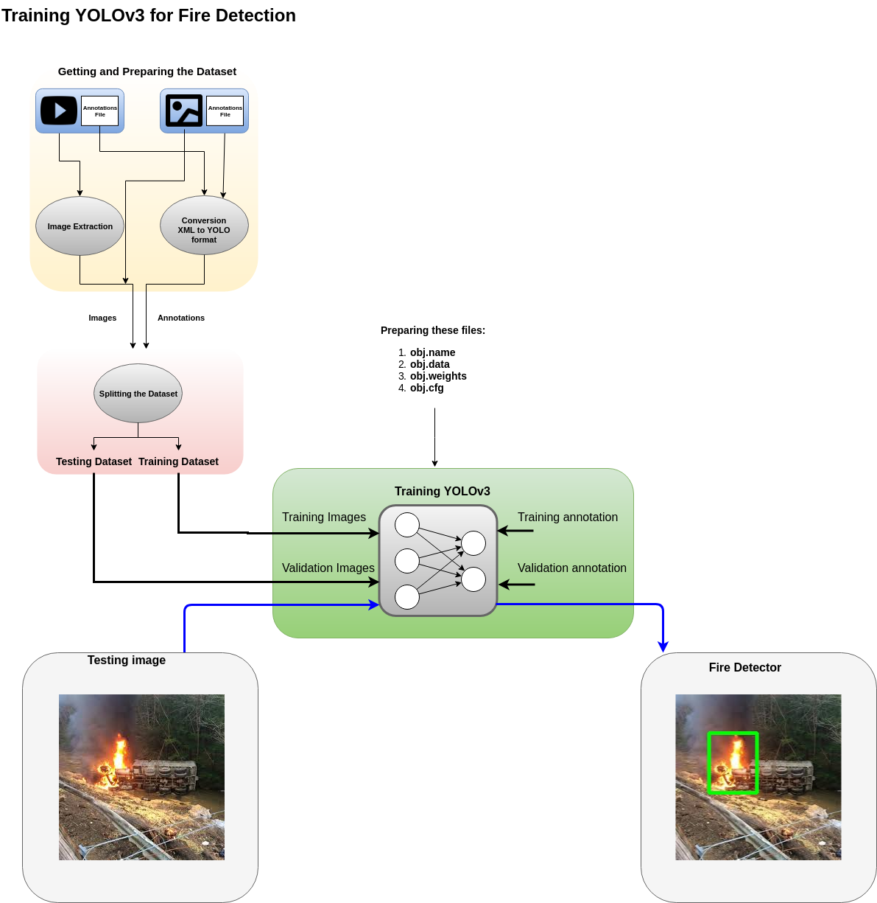
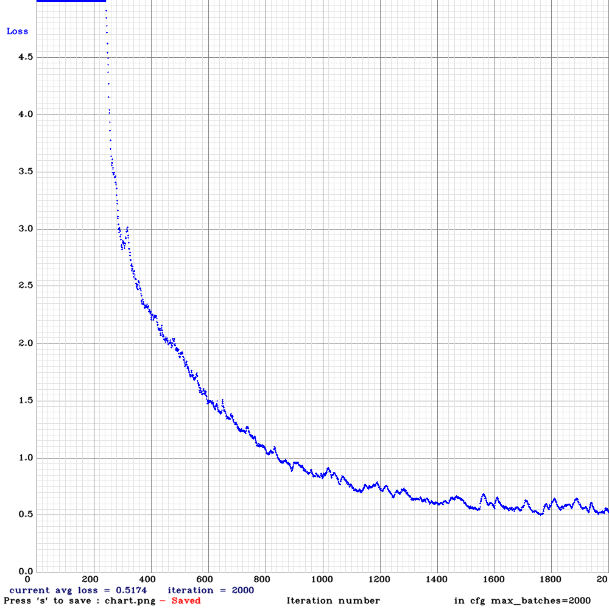

# Training a Fire Detector
This folder illustrate the steps for training YOLOv3 and YOLOv3-tiny to detect fire in images and videos.

First a fire dataset of labeled images is collected from internet. The images with their annotations have been prepared and converted into YOLO format and put into one folder to gather all the data. Therefore, the data folder contains images ('*jpg') and their associated annotations files ('.txt') with the same name.

The annotations need to be converted into YOLO format, which is :

```
<class_id, x_c/W, y_c/H, h/H, w/W>
```


## Retrain YOLO on a Costum Dataset



### YOLOv3

1. Create a customized configuration file for YOLO model from  `cfg/yolov3.cfg`
    
    ```
    cp cfg/yolov3.cfg yolov3-obj.cfg
    ```

    ```
    yolov3-obj.cfg
        [net]
        # Testing
        # batch=64
        # subdivisions=8
        # Training
        batch=64
        subdivisions=16
        width=416
        height=416
        channels=3
        momentum=0.9
        decay=0.0005
        angle=0
        saturation = 1.5
        exposure = 1.5
        hue=.1
        ...
    ```

2. Open `yolov3-obj.cfg` and edit its content with the appropriate information. In this application we have only one object to detect, 'fire', thus, `nb_class = 1`

    ```
    * batch = 64
    * subdivision=8 (increase if `Out of memory`)
    * filters = (nb_class+5)*3: filters = 255 => filter = 18
    * classes = nb_class: classes = 80  => classes = 1
    * max_batches=classes*2000: max_batches = 2000
    * steps=80% and 90% of max_batches : steps = 1600, 1800

    ```

3. Create a file `train.txt` that lists paths of all annotated images (*.jpg) of the dataset `data/obj/`

    ```
    train.txt 
        data/obj/pic (132).jpg
        data/obj/img (42).jpg
        data/obj/img (90).jpg
        data/obj/pic (148).jpg
        data/obj/small (82).jpg
        data/obj/small (55).jpg
        data/obj/small (73).jpg
        data/obj/small (53).jpg
        data/obj/pic (42).jpg
        ...

    ```
    

4. Create `obj.names` and list the classes names
    
    ```
    obj.names
        fire
    ```

5. Create and setup a data file `obj.data` 

    ```
    obj.data
        classes = 1
        train  = train.txt
        valid  = train.txt
        names = obj.names
        backup = backup/
    ```

6. Download pre-trained weights for the convolutional layers (154 MB): [https://pjreddie.com/media/files/darknet53.conv.74](https://pjreddie.com/media/files/darknet53.conv.74)

7. Start training by using the command line

    ```
    ./darknet detector train yolov3-obj.cfg obj.data darknet53.conv.74
    ```

8. test: 
```
./darknet detector test obj.data  yolov3-obj.cfg backup/yolov3-obj_final.weights
```

### YOLOv3-tiny


1. Create a customized configuration file for YOLO model from  `cfg/yolov3-tiny_obj.cfg`

    ```
    cp cfg/yolov3.cfg yolov3-obj.cfg
    ```
    ```
    yolov3-obj.cfg
        [net]
        # Testing
        # batch=64
        # subdivisions=8
        # Training
        batch=64
        subdivisions=16
        width=416
        height=416
        channels=3
        momentum=0.9
        decay=0.0005
        angle=0
        saturation = 1.5
        exposure = 1.5
        hue=.1
        ...
    ```

2. Open `yolov3-obj.cfg` and edit its content with the appropriate information. In this application we have only one object to detect, 'fire', thus, `nb_class = 1`

    ```
    * batch = 64
    * subdivision=8 (increase if `Out of memory`)
    * filters = (nb_class+5)*3: filters = 255 => filter = 18
    * classes = nb_class: classes = 80  => classes = 1
    * max_batches=classes*2000: max_batches = 2000
    * steps=80% and 90% of max_batches : steps = 1600, 1800

    ```
3. Get pre-trained weights `yolov3-tiny.conv.15`

```
./darknet partial cfg/yolov3-tiny.cfg fire/model/yolov3-tiny.weights fire/model/yolov3-tiny.conv.15 15
```

4. Training

```
./darknet detector train obj.data yolov3-tiny-obj.cfg fire/model/yolov3-tiny.conv.15
```

5. Testing

```
./darknet detector test obj.data yolov3-tiny-obj.cfg backup/yolov3-tiny-obj_final.weights
```

6. Results

```bash
v3 (mse loss, Normalizer: (iou: 0.750000, cls: 1.000000) Region 23 Avg (IOU: 0.664938, GIOU: 0.652729), Class: 0.999684, Obj: 0.376908, No Obj: 0.000314, .5R: 1.000000, .75R: 0.000000, count: 3

 2000: 0.604868, 0.560218 avg loss, 0.000010 rate, 1.346011 seconds, 128000 images
Saving weights to backup//yolov3-tiny-obj_2000.weights
Saving weights to backup//yolov3-tiny-obj_last.weights
Saving weights to backup//yolov3-tiny-obj_final.weights
```




## Test of the Trained Fire Detection Application

### Image
 
Detect fire in an imahge file

    ```
    ./darknet detector test fire/obj.data fire/cfg/yolov3-tiny-obj.cfg fire/model/yolov3-tiny-obj_final.weights fire/data/obj/img (1).jpg
    ```
### Video

* Detect fire in real-time video stream from webcam

    ```
    ./darknet detector demo fire/obj.data fire/cfg/yolov3-tiny-obj.cfg fire/model/yolov3-tiny-obj_final.weights
    ```

* Test on video stream from file

    ```
    ./darknet detector demo fire/obj.data fire/cfg/yolov3-tiny-obj.cfg fire/model/yolov3-tiny-obj_final.weights fire/videos/test.mp4
    ```


# Pre-trained Models

There are weights-file for different cfg-files (smaller size -> faster speed & lower accuracy:

    * `yolov3-openimages.cfg` (247 MB COCO Yolo v3) - requires 4 GB GPU-RAM: https://pjreddie.com/media/files/yolov3-openimages.weights

    * `yolov3-spp.cfg` (240 MB COCO Yolo v3) - requires 4 GB GPU-RAM: https://pjreddie.com/media/files/yolov3-spp.weights

    * `yolov3.cfg` (236 MB COCO Yolo v3) - requires 4 GB GPU-RAM: https://pjreddie.com/media/files/yolov3.weights

    * `yolov3-tiny.cfg` (34 MB COCO Yolo v3 tiny) - requires 1 GB GPU-RAM: https://pjreddie.com/media/files/yolov3-tiny.weights

    * `enet-coco.cfg` (EfficientNetb0-Yolo- 45.5% mAP@0.5 - 3.7 BFlops) 
    
    [`enetb0-coco_final.weights`](https://drive.google.com/file/d/1FlHeQjWEQVJt0ay1PVsiuuMzmtNyv36m/view) and `yolov3-tiny-prn.cfg` (33.1% mAP@0.5 - 3.5 BFlops - more)

# Reference

* https://github.com/AlexeyAB/darknet